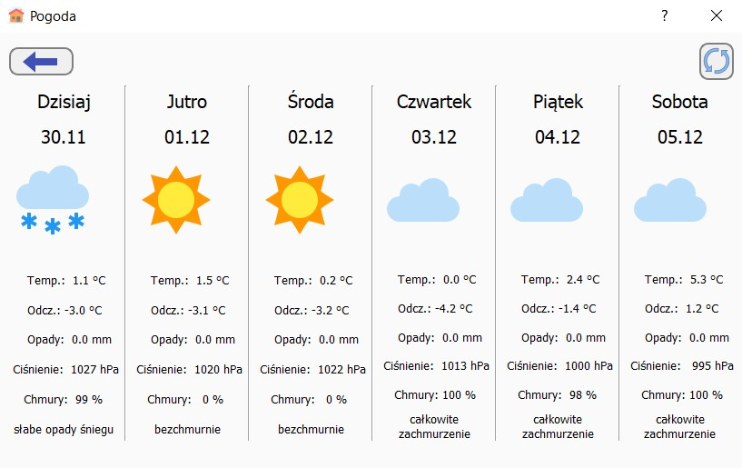
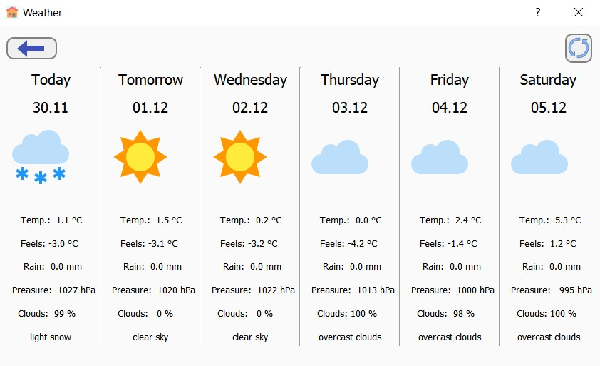

# Home_automation
Home automation project for controlling chickencoop and sprinklers. It also offers weather forecast. Project uses MQTT to talk with Raspberry [code](https://github.com/mateusur/Chickencoop_automation) and NodeMCU [code](https://github.com/mateusur/Home_automation_watering). For streaming Raspberry uses uv4l and camera with infrared LEDs. Home automation project also features two languages to choose from - English and Polish.   
## Built with
- [Qt](https://www.qt.io/)
- [Sourcetree](https://www.sourcetreeapp.com/)
## Icons from  
- [Icons8](https://icons8.com/)
## Screenshots from application 
  

  
  

  

  

  

